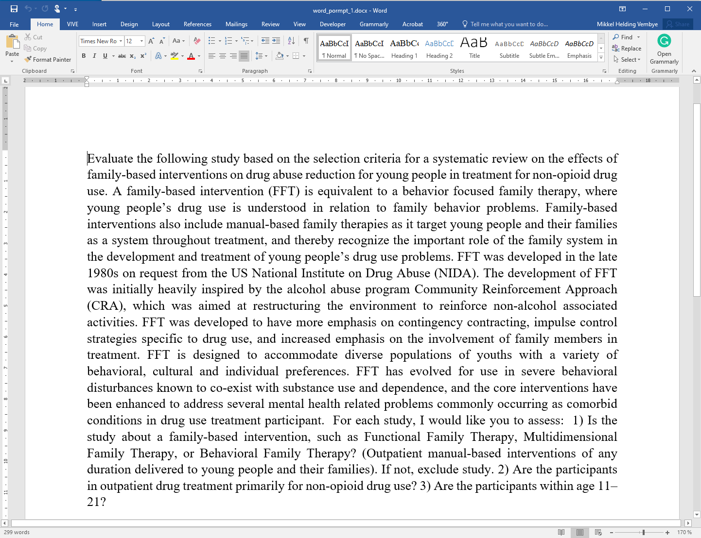
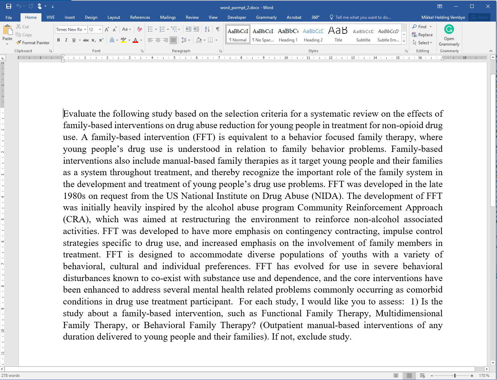

```{r, include = FALSE}
knitr::opts_chunk$set(
  collapse = TRUE,
  comment = "#>",
  out.width = "100%",
  eval = FALSE
)

# Add options
options(pillar.sigfig = 4) # ensure tibble include 4 digits
options(tibble.width = 220)
options(dplyr.print_min = 10)
options(scipen = 20)
options(dplyr.summarise.inform = FALSE) # Avoids summarize info from tidyverse
options(HTTPUserAgent = "Mozilla/5.0")
```

<div class="warning" style='margin-left:2em; margin-right:2em; margin-bottom:2em; margin-top:2em; padding:0.1em; background-color: #d7dbdd; border: solid #bdc3c7 3px'>
<span>
<p style='margin-top:1em; text-align:center'>
<b>Important note</b></p>
<p style='margin:1em'>
This is work-in-progress only. For now, see Vembye et al. (2024) for an overview of how and when GPT API models can be used for title and abstract (TAB) screening. For an overview of other research regarding the use of GPT API models for title and abstract screening, see Syriani et al. (2023), Guo et al., (2024), and Gargari et al. (2024). On a related line of research, Alshami et al. (2023), Khraisha et al. (2024), and Issaiy et al. (2024) explored using the ChatGPT web browser interface for TAB screening. Based on our experience, we think that these two lines of research should not be mixed up since the draw on different GPT models. 
</p></span>
</div>

In this vignette, we show how to conduct title and abstract screening with OpenAI's GPT API models in R. The advantages of conducting the screening with GPT API models via R is 1) that reviewers can easily work with a large number of references, avoiding copy-paste procedures (cf. Khraisha et al., 2024), 2) that the total screening time can be substantially decreased relative to using the ChatGPT interface, since screenings can be done in parallel, 3) that it eases model comparison, and 4) that consistency between GPT answer for the same title and abstract can easily be tested. It is important to stress that the GPT API models used for TAB screening should always be use carefully and be assisted by a human (human-in-the-loop). Consequently, we do not recommend to use the `AIscreenR` as a single screener, unless this an absolutely final solution. .    

## Getting started: Loading relevant ris file data for screening
At this stage, we expect that you have a pile of ris-files, containing titles and abstracts for the references you would like to screen. You can retrieve ris-files in several ways, either directly from research database, a Google Scholar search, or exported from your reference management tool, such as EndNote, Mendeley, and RefMan. Alternatively, you can export ris-file from systematic software tool such as [EPPI-reviewer](https://eppi.ioe.ac.uk/EPPIReviewer-Web/home), [Covidence](https://www.covidence.org/), [MetaReviewer](https://www.metareviewer.org/), [`revtools`](http://www.eshackathon.org/revtools/), or whatever software you use. In the example given below, we load ris-files extracted from the [EPPI-reviewer](https://eppi.ioe.ac.uk/cms/Default.aspx?tabid=2914). A minor advantage of extracting ris-files from systematic software tools is that they add a unique study ID to each reference. This feature makes it easier to keep track of the screening. Yet, such IDs are automatically generated in the `tabscreen_gpt()` function if unique IDs are missing. When using a GPT API model as the second screener, we recommend that the human screening has been done before uploading ris-file(s) to R. Thereby, it is possible to compare the screenings instantly after the computer screening has been done. In the below example we load ris-files separately for excluded and included ris-files, respectively, and add the `human_code` variable to track the human decision.   

```{r, eval = FALSE, warning=FALSE, message=FALSE}
# Loading packages 
library(AIscreenR) # Used to screen and calculate gpt vs. human performance
library(revtools)  # Used to load ris-files
library(tibble)    # Used to work with tibbles
library(dplyr)     # Used to work with tibbles
library(purrr)
library(usethis)
library(future)    # Used to conduct screenings in parallel
```


```{r, eval = FALSE}
# Reading path to risfiles
excl_path <- system.file("extdata", "excl_tutorial.ris", package = "AIscreenR")

# Loading EXCLUDED studies
ris_dat_excl <- revtools::read_bibliography(excl_path) |> 
  suppressWarnings() |> 
  as_tibble() |>
  select(author, eppi_id, title, abstract) |> # Using only relevant variables
  mutate(
    human_code = 0,
    across(c(author, title, abstract), ~ na_if(., "NA"))
  )

# Loading INCLUDED studies
incl_path <- system.file("extdata", "incl_tutorial.ris", package = "AIscreenR")

ris_dat_incl <- revtools::read_bibliography(incl_path) |> 
  suppressWarnings() |> 
  as_tibble() |>
  select(author, eppi_id, title, abstract) |>
  mutate(
    human_code = 1,
    across(c(author, title, abstract), ~ na_if(., "NA"))
  )

filges2015_dat <- 
  bind_rows(ris_dat_excl, ris_dat_incl) |> 
  mutate(
    studyid = 1:n()
  ) |> 
  relocate(studyid, .after = eppi_id)


filges2015_dat
#> # A tibble: 270 × 6
#>   author                       eppi_id studyid title abstract human_code
#>   <chr>                        <chr>     <int> <chr> <chr>         <dbl>
#> 1 Holloway R G and Gramling R… 9434957       1 Esti… "Progno…          0
#> 2 Morawska Alina and Stallman… 9433838       2 Self… "Behavi…          0
#> 3 Michel C M and Pascual-Marq… 9431171       3 Freq… "The to…          0
#> 4 Paul Howard A                9433968       4 A Re… "The ar…          0
#> 5 Feinberg I and De Bie E and… 9434460       5 Topo… "STUDY …          0
#> 6 Hamburg Sam R                9433554       6 BOOK… "The ar…          0
#> 7 Park H Y and Lee B J and Ki… 9435130       7 Rapi… "Backgr…          0
#> 8 Petrek J                     9432040       8 Pict… "AIMS: …          0
#> 9 Schwartzman Meredith P and … 9434093       9 Enha… "New an…          0
#>10 Faber J and Srutova L and P… 9431505      10 EEG … "Sponta…          0
#># ℹ 260 more rows
#># ℹ Use `print(n = ...)` to see more rows
```

## Getting API key (OpenAI)

Before you can use the `AIscreenR` to screen your references, you must generate your own secret API key from OpenAI. To do so you must first ensure that you have created an account at OpenAI (*if you have not done so at this stage, you can sign up [here](https://auth0.openai.com/u/login/identifier?state=hKFo2SBqQjNHSlc1ejIyREpUb01hdDF2OHEzQy12NnJwWlFUN6Fur3VuaXZlcnNhbC1sb2dpbqN0aWTZIEJSOWJaamdKLWswNGlfWDQ2NER1OXJmVUNpVmVzVjZfo2NpZNkgRFJpdnNubTJNdTQyVDNLT3BxZHR3QjNOWXZpSFl6d0Q)).* When having an account, go to [https://platform.openai.com/account/api-keys](https://platform.openai.com/account/api-keys) and press the `+ Create new secret key` button (see Figure 1 below) and give your key a name. 

\  

```{r eval=TRUE, echo=FALSE, fig.cap='*Figure 1 - Generate API key from OpenAI*'}
knitr::include_graphics("helper-stuff/API_key_pic.png")
```
\ 

When you have generated your secret API key, remember to store it safely since
you will not be able see it again. **NOTE**: *If you lose your API key, you can 
just generate a new one*. 

## Handling your API key 

When you have retrieved your API, you could in theory add it directly to the 
`AIscreenR` functions via the `api_key` argument. Yet, this would be an improper
way to work the API key since you would easily compromise your secret key. For example, 
your API key would be disclosed when sharing your codes with others, which gives them 
access to draw on your OpenAI account. Furthermore, OpenAI will cancel the API key if they recognize 
that your API key has been compromised (e.g., if you push it to a public GitHub page). 
To overcome this issue you have several options from here. You can either work with what we call
permanent or temporary solutions. 

### Permanent solution

The easiest way to work with your API key is to permanently add it to your R environment
as an environment variable. This can be achieved with `usethis::edit_r_environ()`. In the `.Renviron`
file, write `CHATGPT_KEY=your_key` as depicted in Figure 2. After entering the API key, close and save the `.Renviron` file and restart `RStudio` (ctrl + shift + F10). From now on, the `AIscreenR` functions will use the `get_api_key()` function to retrieve your API key from your R environment automatically. By using this approach you don't have to worry more about you API key (unless you update RStudio, deliberately delete the key, or get a new computer. Then you must repeat this process).
\  

```{r eval=TRUE, echo=FALSE, fig.cap='*Figure 2 - R environment file*'}
knitr::include_graphics("helper-stuff/Renviron.png")
```
\ 

### Temporary solution

If you do not want to add you API key permanently to your R environment, you can 
use `set_api_key()`. When executing `set_api_key()`, you will see a pop-up window in
which you can enter your API key. This will add your API key as temporary environment variable. 
Consequently, when you restart RStudio, you will no longer be able to find your 
API key in your R environment. Alternatively, you can pass a decrypted key to the `set_api_key()`, like
`set_api_key(key = secret_decrypt(encrypt_key, "YOUR_SECRET_KEY_FOR_DECRYTING"))`. See the [`HTTR2`](https://httr2.r-lib.org/articles/wrapping-apis.html#basics) package for further details about this solution. 
\  

```{r eval=TRUE, echo=FALSE, fig.cap='*Figure 3 - Set API key*'}
knitr::include_graphics("helper-stuff/set_api.png")
```
\ 

## Working with prompts in R

Example of how to enter a prompt. 

```{r, eval = FALSE}
prompt <- "Evaluate the following study based on the selection criteria
for a systematic review on the effects of family-based interventions on drug 
abuse reduction for young people in treatment for non-opioid drug use.
A family-based intervention (FFT) is equivalent to a behavior focused
family therapy, where young people’s drug use is understood in relation to 
family behavior problems. Family-based interventions also includes manual-based 
family therapies as it targets young people and their families as a system 
throughout treatment, and thereby recognizes the important role of the family 
system in the development and treatment of young people’s drug use problems. 
FFT was developed in the late 1980s on request from the US National Institute on
Drug Abuse (NIDA). The development of FFT was initially heavily inspired by the 
alcohol abuse program Community Reinforcement Approach (CRA), which was aimed 
at restructuring the environment to reinforce non-alcohol associated activities. 
FFT developed to have more emphasis on contingency contracting, impulse control 
strategies specific to drug use, and increased emphasis on involvement of family 
members in treatment. FFT is designed to accommodate diverse populations of 
youths with a variety of behavioral, cultural and individual preferences. 
FFT has evolved for use in severe behavioral disturbances known to co-exist with
substance use and dependence, and the core interventions have been enhanced to 
address several mental health related problems commonly occurring
as comorbid conditions in drug use treatment participant.  For each study,
I would like you to assess:  1) Is the study about a family-based intervention,
such as Functional Family Therapy, Multidimensional Family Therapy, or
Behavioral Family Therapy? (Outpatient manual-based interventions of any
duration delivered to young people and their families). If not, exclude study.
2) Are the participants in outpatient drug treatment primarily
for non-opioid drug use? 3) Are the participants within age 11–21?"
```

Can also be done in word

\  

```{r eval=TRUE, echo=FALSE, fig.cap='*Figure 4 - Prompt 1: With three inclusion critera.*'}

```
\ 

\  

```{r eval=TRUE, echo=FALSE, fig.cap='*Figure 5 - Prompt 2: With one inclusion criterion only.*'}

```
\ 

```{r}
word_path <-  system.file("extdata", "word_prompt_1.docx", package = "AIscreenR")

prompt1 <- 
  readtext::readtext(word_path)$text |> 
      stringr::str_remove_all("\n")

prompt1

# Working with multiple prompts
word_paths <- system.file("extdata", c("word_prompt_1.docx", "word_prompt_2.docx"), package = "AIscreenR")

prompts <- 
  purrr::map_chr(
    word_paths, ~ {
      readtext::readtext(.x)$text |> 
        stringr::str_remove_all("\n")
    } 
  )

prompts 
```


## Retrieve rate limit information 

```{r,  eval = FALSE}
# Rate limits across one model (Default is "gpt-3.5-turbo-0613")
rate_limits <- rate_limits_per_minute()
rate_limits
#> # A tibble: 1 × 3
#>   model              requests_per_minute tokens_per_minute
#>   <chr>                            <dbl>             <dbl>
#> 1 gpt-3.5-turbo-0613               10000           1000000


# Rate limits overview across multiple models
# Add further models if necessary
models <- c("gpt-3.5-turbo-0613", "gpt-4")

models_rate_limits <- rate_limits_per_minute(model = models) 
models_rate_limits
#> # A tibble: 2 × 3
#>   model              requests_per_minute tokens_per_minute
#>   <chr>                            <dbl>             <dbl>
#> 1 gpt-3.5-turbo-0613               10000           1000000
#> 2 gpt-4                              200             10000
```

## Approximate price of screening

Approximate price of screening

```{r, echo = FALSE}
models <- c("gpt-3.5-turbo-0613", "gpt-3.5-turbo-0613", "gpt-4")
```

```{r, eval = FALSE}
app_obj <- 
  approximate_price_gpt(
    data = filges2015_dat, # Tutorial data embedded in the package
    prompt = prompts, 
    studyid = studyid, # indicate the variable with the studyid in the data
    title = title, # indicate the variable with the titles in the data
    abstract = abstract, # indicate the variable with the abstracts in the data
    model = c("gpt-4o", "gpt-4"),
    reps = 1
  )

app_obj
#> The approximate price of the (simple) screening will be around $3.0573.

app_obj$price_dollar
#> [1] 3.0573
app_obj$price_data

```

## Screening titles and abstracts
```{r, message=FALSE, eval=FALSE}
models <- c("gpt-3.5-turbo-0613", "gpt-3.5-turbo-0613", "gpt-4")
reps <- c(1, 10, 1)
rpm <- c(10000, 10000, 200)

plan(multisession)

result_object <- 
  tabscreen_gpt.original(
    data = filges2015_dat, # ris-file data create above 
    prompt = prompt, # indicate name of the loaded prompt object
    studyid = studyid, # indicate the variable with the studyid in the data
    title = title, # indicate the variable with the titles in the data
    abstract = abstract, # indicate the variable with the abstracts in the data,
    model = c("gpt-3.5-turbo-0613", "gpt-3.5-turbo-0613", "gpt-4"),
    reps = c(1, 10, 1),
    rpm = c(10000, 10000, 200),
    top_p = c(0.001, 1)
  )
#> * The approximate price of the current (simple) screening will be around $27.9901.
#> * Consider removing references that has no abstract since these can distort the accuracy of the screening
#>  Progress: ──────────────────────────────────────────────────────────────────────────────────────────── 100%
#>  * NOTE: Requests failed 4 times."

plan(sequential)

print(result_object)
#> Find data with all answers by executing
#>  result_object$answer_data_all
#> 
#> Find data with the result aggregated across multiple answers by executing
#>  result_object$answer_data_sum
#> 
#> Find total price for the screening by executing
#>  result_object$price_dollar
#> 
#> Find error data by executing
#>  result_object$error_data
```

## Screen failed requests

```{r, eval=FALSE}
result_object <- 
  result_object |> 
  screen_errors()

print(result_object)
#> Find data with all answers by executing
#>  result_object$answer_data_all
#> 
#> Find data with the result aggregated across multiple answers by executing
#>  result_object$answer_data_sum
#> 
#> Find total price for the screening by executing
#>  result_object$price_dollar
```

```{r, echo=FALSE}
result_object <- AIscreenR:::result_object_no_err
```


## Getting the results from the screening

```{r}
# gpt-3.5 results (prompt 1, top_p = 1, 10 replications)
# studyid = 21 is not included since it failed during the loop
# I show how to recover this in another 
sum_dat_gpt3 <- 
  result_object$answer_data_sum |> 
  filter(stringr::str_detect(model, "3") & promptid == 1 & reps == 10 & top_p == 1)

# gpt-4 results (prompt 1, top_p = 1)
sum_dat_gpt4 <- 
  result_object$answer_data_sum |> 
  filter(stringr::str_detect(model, "4") & promptid == 1 & top_p == 1)
```


## Analyzing the screening

### Simple table
```{r tables}
# gpt3.5 result
table(gpt = sum_dat_gpt3$final_decision_gpt_num, human = sum_dat_gpt3$human_code)
table(gpt = sum_dat_gpt4$final_decision_gpt_num, human = sum_dat_gpt4$human_code)
```

### False included and excluded (by gpt)

```{r screen_stats}
screen_perform <- 
  result_object |> 
  screen_analyzer() 

screen_perform
```

## Getting detailed descriptions 

```{r}
# Show example with gpt-4
```


# References
Alshami, A., Elsayed, M., Ali, E., Eltoukhy, A. E. E., & Zayed, T. (2023). Harnessing the power of ChatGPT for automating systematic review process: Methodology, case study, limitations, and future directions. *Systems*. 11(7).

Gargari, O. K., Mahmoudi, M. H., Hajisafarali, M., & Samiee, R. (2024). Enhancing title and abstract screening for systematic reviews with GPT-3.5 turbo. *BMJ Evidence-Based Medicine*, 29(1), 69 LP – 70. <https://doi.org/10.1136/bmjebm-2023-112678>

Guo, E., Gupta, M., Deng, J., Park, Y.-J., Paget, M., & Naugler, C. (2024). Automated Paper Screening for Clinical Reviews Using Large Language Models: Data Analysis Study. *Journal of Medical Internet Research*. <https://doi.org/10.2196/48996>

Issaiy, M., Ghanaati, H., Kolahi, S., Shakiba, M., Jalali, A. H., Zarei, D., Kazemian, S., Avanaki, M. A., & Firouznia, K. (2024). Methodological insights into ChatGPT’s screening performance in systematic reviews. *BMC Medical Research Methodology*, 24(1), 78. <https://doi.org/10.1186/s12874-024-02203-8>

Khraisha Q, Put S, Kappenberg J, Warraitch A, Hadfield K (2024). Can large language models replace humans in systematic reviews? Evaluating GPT-4's efficacy in screening and extracting data from peer-reviewed and grey literature in multiple languages. 
*Research Synthesis Methods*. 1-11. <https://doi.org/10.1002/jrsm.1715>

Syriani, E., David, I., & Kumar, G. (2023). Assessing the Ability of ChatGPT to Screen Articles for Systematic Reviews. *ArXiv Preprint ArXiv:2307.06464.* <http://arxiv.org/pdf/2307.06464>

Vembye, M., Christensen, J., Mølgaard, A. B., Schytt, F.L.W. (2024). GPT API Models Can Function as Highly Reliable Second Screeners of Titles and Abstracts in Systematic Reviews: A Proof of Concept and Common Guidelines. *Open Science Framework (OSF)*. <https://doi.org/10.31219/osf.io/yrhzm>

Westgate MJ (2019). revtools: An R package to support article screening for evidence synthesis. *Research Synthesis Methods*. <https://doi.org/10.1002/jrsm.1374>.
