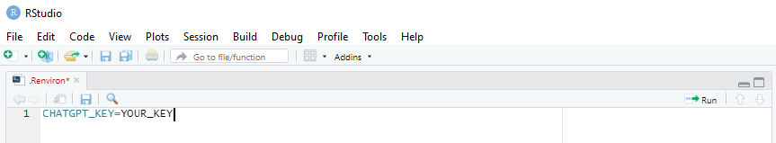

```{r, include = FALSE}
knitr::opts_chunk$set(
  collapse = TRUE,
  comment = "#>",
  out.width = "100%",
  eval = FALSE
)
```

<div class="warning" style='margin-left:2em; margin-right:2em; margin-bottom:2em; margin-top:2em; padding:0.1em; background-color: #d7dbdd; border: solid #bdc3c7 3px'>
<span>
<p style='margin-top:1em; text-align:center'>
<b>Important note</b></p>
<p style='margin:1em'>
*This is work-in-progress only. For now, see [Vembye, Christensen, Mølgaard, & Schytt](https://osf.io/preprints/osf/yrhzm) [-@Vembye2024_gpt] for an overview of how and when GPT API models can be used for title and abstract (TAB) screening. Our most recent results suggest that the `gpt-4o-mini` is an effective model for screening titles and abstracts with performances in many cases on par with `gpt-4`. This is a very cheap model (200 times cheaper than `gpt-4`). Therefore, to reduce costs, we recommendation always testing the performance of `gpt-4o-mini` before considering other models. For an overview of additional research on the use of GPT API models for title and abstract screening, see Syriani et al. [-@Syriani2023; -@Syriani2024], Guo et al., [-@Guo2024], and Gargari et al. [-@Gargari2024]. On a related line of research, Alshami et al. [-@Alshami2023], Khraisha et al. [-@Khraisha2024], and Issaiy et al. [-@Issaiy2024] explored the use of the ChatGPT web browser interface for TAB screening. Based on our experience, we believe these two lines of research should not be conflated, as they rely on different GPT models and setups.*
</p></span>
</div>

Conducting a systematic review is most often resource-demanding. A critical first step to ensure the quality of systematic reviews and meta-analyses herein involves detecting all eligible references related to the literature under review [@Polanin2019]. This entails searching all pertinent literature databases relevant to the given review, most often resulting in thousands of titles and abstracts to be screened for relevance. Manual screening hereof can be a time-consuming and tedious task. However, overlooking relevant studies at this stage can be consequential, leading to substantially biased results if the missed studies differ systematically from the detected studies. To mitigate this resource issue, we demonstrate in this vignette how to use OpenAI's GPT (Generative Pre-trained Transformer) API (Application Programming Interface) models for title and abstract screening in R. Specifically, we show how to create a test dataset and assess whether GPT is viable as the second screener in your review [cf. @Vembye2024_gpt]. 
\ 

At this point, you might ask, why use GPT API models via R instead of simply using ChatGPT for screening? The answer is that using R offer certain advantages: 

  1. Reviewers can easily work with a large number of references, avoiding the need for manual copy-paste procedures
  [cf. @Khraisha2024].  
  2. The screening time can be substantially reduced compared to using the ChatGPT interface, as screening can be performed in parallel. In theory, you can screen 30,000 titles and abstracts per minute.
  3. It eases model comparison.
  4. Consistency between the GPT answer for the same title and abstract can be easily tested. You can also conduct multiple screenings and make inclusion judgments based on how often a study is included across a set number of screenings. 
  5. When using the `gpt-4o-mini`, it is often cheaper than subscribing to ChatGPT plus. 
  6. Research suggest that GPT API models and the ChatGPT yield notably different screening performance, with the latter proving insufficient as an independent second screener. 

That said, we would also like to emphasize that screening with the GPT API models should be conducted carefully and always be assisted by humans (human-in-the-loop). Consequently, we do not recommend to use the a GPT API model as a single screener, unless this an absolutely final solution. When using a GPT API model as the second screener, we also recommend completing the human screening before uploading RIS file(s) to R. This allows for immediate comparison once the GPT screening is complete and ensures humans are then not impacted/biased by the GPT decision.

# Get Started
For many reviewers, especially those unfamiliar with coding in R, conducting a title and abstract screening in R can seem overwhelming. However, it’s important to emphasize that running your first screening only requires a few relatively simple steps:

  1. Load and convert your RIS file data to a data frame.
  2. Handle your API key (this is only necessary the first time you screen).
  3. Make one or multiple prompts.
  4. Run the screening.

And if the human screening has been conducted (as in the example below):

  5. Analyze the screening results.
  6. Investigate and resolve any disagreements.
  7. Conduct the full title and abstract screening.
  
We will walk through each of these steps one by one in the following sections. 

# Load and Convert RIS File Data to a Data Frame
At this stage, we expect that you have a collection of RIS files containing titles and abstracts for the references you wish to screen. You can obtain RIS files in several ways:  directly from the research databases, a Google Scholar search; or by exported them from your reference management tool, such as EndNote, Mendeley, and RefMan. Alternatively, you can export RIS files from systematic software tools such as [EPPI-reviewer](https://eppi.ioe.ac.uk/cms/Default.aspx?tabid=2914), [Covidence](https://www.covidence.org/), [MetaReviewer](https://www.metareviewer.org/), [`revtools`](http://www.eshackathon.org/revtools/) [@westgate2019], among others. In the example below, we load RIS files extracted from [EPPI-reviewer](https://eppi.ioe.ac.uk/cms/Default.aspx?tabid=2914). A minor advantage of exporting RIS files from systematic software tools is that they often add a unique study ID to each reference, making it easier to track the screening process. However, such IDs are automatically generated in `tabscreen_gpt()` if they are missing. 

## Load relevant R packages
To get started, we first load all R package needed to construct and run the screening.
```{r, eval = FALSE, warning=FALSE, message=FALSE}
# Loading packages 
library(AIscreenR) # Used to screen and calculate gpt vs. human performance
library(synthesisr)  # Used to load RIS files
library(tibble)    # Used to work with tibbles
library(dplyr)     # Used to manipulate data
library(purrr)     # For loops 
library(usethis)   # Used to add the API key the R environment (only relevant the first time you screen)
library(future)    # Used to conduct screenings in parallel
```

## Convert RIS files to data frames
Now, we are ready to conduct the first step of the screening: loading the RIS file data into R and converting it to a data frame. This can be done by using `read_refs()` from `synthesisr`. This is an updated version of the `read_bibliography()` function from the `revtools` package that works reliable. In the below example, we use RIS file data from a review regarding the effects of the FRIENDS preventive programme on anxiety symptoms in children and adolescents [@Filges2024]. Be aware, that this data is used for illustrative purposes only. In the example, we assume that the human reviewers have already started screening and identified several relevant and irrelevant studies, which they will use to create the test data. Thus, we can load the RIS files, which we downloaded from the EPPI-reviewer, separately for the in- and excluded RIS files. This allows us to track the human decision by adding a `human_code` variable, where `1` and `0` indicate whether a study is included or excluded, respectively.

```{r}
# NOTE: Find the RIS files behind this vignette at https://osf.io/kfbvu/

# Loading EXCLUDED studies
ris_dat_excl <- read_refs("friends_excl.ris") |> # Add the path to your RIS file here
  as_tibble() |>
  select(author, eppi_id, title, abstract) |> # Using only relevant variables
  mutate(
    human_code = 0, #Tracking the human decision
    across(c(author, title, abstract), ~ na_if(., "NA"))
  )

ris_dat_excl
#> # A tibble: 2,765 × 5
#>   author                                                                eppi_id title abstract human_code
#>   <chr>                                                                 <chr>   <chr> <chr>         <dbl>
#> 1 Lovat C                                                               911525… "'Ba… "Postna…          0
#> 2 Kohler Maxie                                                          911023… "\"F… "The ar…          0
#> 3 Stevens Eleanor and Wood Jane                                         911020… "\"I… "'Non-o…          0
#> 4 Essau C and Conradt J and Ederer E                                    915786… "[An…  NA               0
#> 5 K<c3><a4>ssler P and Breme K                                          915784… "[Ev…  NA               0
#> 6 Brubaker Ruth B and Bay Curt and Chacon Daniel W and Carson Madelein… 911523… "93 … "Introd…          0
#> 7 Kumar Suresh and Vellymalay N                                         915785… "A C…  NA               0
#> 8 Lock S                                                                915784… "A D…  NA               0
#> 9 Bosco Nicolina and Giaccherini Susanna and Meringolo Patrizia         911019… "A g… "This a…          0
#>10 Abd El Salam, Amira E and AbdAllah Amany M and El Maghawry Hala A     911017… "Eff… "Backgr…          0
#># ℹ 2,755 more rows
#># ℹ Use `print(n = ...)` to see more rows

# Loading INCLUDED studies
ris_dat_incl <- read_refs("friends_incl.ris") |> 
  suppressWarnings() |> 
  as_tibble() |>
  select(author, eppi_id, title, abstract) |>
  mutate(
    human_code = 1, #Tracking the human decision
    across(c(author, title, abstract), ~ na_if(., "NA"))
  )

ris_dat_incl
#> # A tibble: 97 × 5
#>   author                                                                eppi_id title abstract human_code
#>   <chr>                                                                 <chr>   <chr> <chr>         <dbl>
#> 1 G<c3><b6>kkaya Fu<cc><88>sun and Gedik Z                              915785… A Sc…  NA               1
#> 2 ACTRN12607000254493                                                   911528… Long… "INTERV…          1
#> 3 ACTRN12615000382572                                                   911528… The … "INTERV…          1
#> 4 Ahlen Johan and Breitholtz Elisabeth and Barrett Paula M and Gallego… 911544… Scho… "Anxiet…          1
#> 5 Ahlen Johan and Hursti Timo and Tanner Lindsey and Tokay Zelal and G… 911019… Prev… "Our st…          1
#> 6 Green Sarah L                                                         915785… An e…  NA               1
#> 7 Anticich Sarah A. J and Barrett Paula M and Silverman Wendy and Lach… 910111… The … "This s…          1
#> 8 Barker Leslie Jayne                                                   915785… Prev…  NA               1
#> 9 Barrett PM and Moore AF and Sonderegger R                             911527… The … "Young …          1
#>10 Barrett PM and Shortt AL and Wescombe K                               911529… Exam…  NA               1
#># ℹ 87 more rows
#># ℹ Use `print(n = ...)` to see more rows
```


## Create the test dataset
Now that we have loaded our reference data, we can construct the test data by randomly sampling 150 irrelevant records [as suggested in @Vembye2024_gpt] and 50 relevant records that include both a title and an abstract.  For this purpose we use `sample_references()`. Again, this is for illustration purposes only, as you may not yet have access to 50 relevant records at this stage of screening. We recommend identifying at least 10 relevant references before constructing the test data. As further described in Vembye et al. [-@Vembye2024_gpt], we remove all records without abstracts, as these can distort the accuracy of the screening.
```{r, eval = FALSE}
set.seed(09042024)

excl_sample <- 
  ris_dat_excl |> 
  filter(!is.na(abstract)) |> 
  sample_references(150)

incl_sample <- 
  ris_dat_incl |> 
  filter(!is.na(abstract)) |> 
  sample_references(50)

test_dat <- 
  bind_rows(excl_sample, incl_sample) |> 
  mutate(
    studyid = 1:n()
  ) |> 
  relocate(studyid, .after = eppi_id)


test_dat
#>  # A tibble: 200 × 6
#>   author             eppi_id studyid title abstract human_code
#>   <chr>              <chr>     <int> <chr> <chr>         <dbl>
#> 1 Moes and Frea Dou… 9433823       1 Usin… Studies…          0
#> 2 Flemke Kimberly R  9432288       2 The … The pur…          0
#> 3 Daniels M Harry a… 9431426       3 A Me… One of …          0
#> 4 Schwartzman Mered… 9434093       4 Enha… New ana…          0
#> 5 White Stuart F an… 9434418       5 Call… OBJECTI…          0
#> 6 Chao-kai X U and … 9432240       6 A no… To deal…          0
#> 7 Todd Thomas C      9434199       7 THE … This ar…          0
#> 8 Kinoshita O and K… 9431762       8 Spec… BACKGRO…          0
#> 9 Stratton Peter an… 9434563       9 Comp… This ar…          0
#>10 Stevens Sally and… 9434158      10 Inte… The num…          0
#># ℹ 190 more rows
#># ℹ Use `print(n = ...)` to see more rows
```

# Handle Your API Key 
Now, we have our test data in place and can move on to the next step of the screening: generating your API key and handling it in R.  

## Get your API key 

Before you can use the `AIscreenR` functions to screen your references, you must generate your own secret API key from OpenAI. To do so, first ensure you have an OpenAI account (*If you have not created one yet, you can sign up [here](https://auth0.openai.com/u/login/identifier?state=hKFo2SBqQjNHSlc1ejIyREpUb01hdDF2OHEzQy12NnJwWlFUN6Fur3VuaXZlcnNhbC1sb2dpbqN0aWTZIEJSOWJaamdKLWswNGlfWDQ2NER1OXJmVUNpVmVzVjZfo2NpZNkgRFJpdnNubTJNdTQyVDNLT3BxZHR3QjNOWXZpSFl6d0Q)).* Once you have an account, go to [https://platform.openai.com/account/api-keys](https://platform.openai.com/account/api-keys) and press the `+ Create new secret key` button (see Figure 1 below) and name your key. 

\  

```{r eval=TRUE, echo=FALSE, fig.cap='*Figure 1 - Generate API key from OpenAI*'}
knitr::include_graphics("helper-stuff/API_key_pic.png")
```
\ 

Once you have generated your secret API key, remember to store it safely, as you will not be able to view it again. **NOTE**: *If you lose your API key, you can simply generate a new one*. 

## Manage your API key in R

After retrieving your API key, you could theoretically add it directly to the `AIscreenR` functions via the `api_key` argument. However, this would be an improper way to work the API key, as it could easily compromise your secret key. For example, your API key would be exposed when sharing your code with others, allowing them to access your OpenAI account. Additionally, OpenAI will deactivate the API key if they detect that it has been compromised (e.g., if you push it to a public GitHub repository).  To prevent  this issue you have several options from here. You can either work with what we call a permanent or a temporary solution. 

### Permanent solution

The easiest way to manage your API key is to add it permanently to your R environment as an environment variable. You can do this by using `usethis::edit_r_environ()`.

```{r}
# Run code to open your .Renviron file
usethis::edit_r_environ()
```

In the `.Renviron` file, write `CHATGPT_KEY=your_key` as depicted in Figure 2. 
\  

```{r eval=TRUE, echo=FALSE, fig.cap='*Figure 2 - R environment file*'}

```
\ 

Thereafter, close and save the `.Renviron` file and restart `RStudio` (ctrl + shift + F10). From now on, the `AIscreenR` functions will automatically use `get_api_key()` to retrieve your API key from your R environment. With this approach, you will not need to worry about your API key again—unless you update RStudio, delete the key deliberately, or get a new computer. In such cases, you will need to repeat this process.

### Temporary solution

If you do not want to add you API key permanently to your R environment, you can 
use `set_api_key()`. When executing `set_api_key()`, a pop-up window will appear where you can enter your API key. This will add your API key as temporary environment variable. 
Consequently, after restarting RStudio, your API key will no longer be present in your R environment. Alternatively, you can pass a decrypted key to the `set_api_key()`, like
`set_api_key(key = secret_decrypt(encrypt_key, "YOUR_SECRET_KEY_FOR_DECRYTING"))`. For further details on this approach, refer to the [`HTTR2`](https://httr2.r-lib.org/articles/wrapping-apis.html#basics) package.
\  

```{r eval=TRUE, echo=FALSE, fig.cap='*Figure 3 - Set API key*'}
knitr::include_graphics("helper-stuff/set_api.png")
```
\ 


# Prompting in R

The next step involves writing one or more prompts to be used for screening. This can be done in several ways. You can either write your prompt directly in R, as illustrated below:

```{r, eval = FALSE}
prompt <- "We are screening studies for a systematic literature review. 
The topic of the systematic review is the effect of the FRIENDS preventive programme
on reducing anxiety symptoms in children and adolescents. The FRIENDS programme is a 
10-session manualised  cognitive behavioural therapy (CBT) programme which can be 
used as both prevention and  treatment of child and youth anxiety.  The study should 
focus exclusively on this topic  and we are exclusively searching  for studies with 
a treatment and a comparison group.  For each study, I would like you to assess:  
1) Is the study about the FRIENDS preventive programme? 
2) Is the study estimating an effect between a treatment and control/comparison group?"
```

Or you can simply write it in Word, as shown in Figures 4. 

\  

```{r eval=TRUE, echo=FALSE, fig.cap='*Figure 4 - Prompting in Word*'}
knitr::include_graphics("helper-stuff/friends_prompt.png")
```
\ 

Then you can load your prompt(s) via `readtext()` from the `readtext` package. 
```{r}
word_path <-  system.file("extdata", "word_prompt_1.docx", package = "AIscreenR")

prompt <- 
  readtext::readtext(word_path)$text |> 
      stringr::str_remove_all("\n")
```

# Run the Test Screening 

Now we are actually ready to conduct the title and abstract screening with `tabscreen_gpt()`. To make the `tabscreen_gpt()` running, one needs to specify the following information:

 1. The data with the title and abstract information.
 2. The prompt(s).
 3. The names of the variables containing the titles and abstracts.
 4. The model(s) you want to use for screening. 
 
Optional

 5. The variable name of the variable containing the study IDs.
 6. The number of screenings you want to run with the given model (Default is `1` but with cheap models it can be advantageous to conduct multiple screenings and make inclusion judgments based on how many times a study has been included across the given number of screenings).
 7. Set the request per minutes.

```{r, message=FALSE, eval=FALSE}
# Gets information about whether you have access to a given model and 
# how many requests per minutes you are allow to send. 
models_rpm <- rate_limits_per_minute("gpt-4o-mini")

# Set parallel plan
plan(multisession) 

result_object <- 
  tabscreen_gpt(
    data = test_dat, # RIS file data created above 
    prompt = prompt, # The prompt made above
    studyid = studyid, # Name of variable containing study IDs
    title = title, # Name of variable containing titles
    abstract = abstract, # Name of variable containing abstracts
    model = "gpt-4o-mini", # Model choice
    reps = 10, # Using multiple screenings with the cheap gpt-4o-mini model
    rpm = models_rpm$requests_per_minute # Requests per minutes retrieved from the above object
  )
#> * The approximate price of the current (simple) screening will be around $0.2237.
#> Progress: ───────────────────────────────────────────────────────────────── 100%

# Back to the sequential plan
plan(sequential)
```

We have now conducted the test screening and can get the raw results as below. 

```{r, message=FALSE, eval=FALSE}
# The print output when calling the result object
result_object
#> 
#> Find the final result dataset via result_object$answer_data_aggregated

result_object$answer_data_aggregated |> 
  select(author, human_code, final_decision_gpt, final_decision_gpt_num)
#> # A tibble: 200 × 4
#>   author                                       human_code final_decision_gpt final_decision_gpt_num
#>   <chr>                                             <dbl> <chr>                               <dbl>
#> 1 Lara Elvira and Mart<c3><ad>n-Mar<c3><ad>a …          0 Exclude                                 0
#> 2 Matsumoto Manabu                                      0 Exclude                                 0
#> 3 Jordan Ann                                            0 Exclude                                 0
#> 4 Antonova E and Hamid A and Wright B and Kum…          0 Exclude                                 0
#> 5 Iafusco Dario                                         0 Exclude                                 0
#> 6 Farrell L J and Barrett P M and Claassens S           0 Include                                 1
#> 7 Rasalingam G and Rajalingam A and Chandrada…          0 Exclude                                 0
#> 8 Chappel J N and DuPont R L                            0 Exclude                                 0
#> 9 Waldrop Deborah P                                     0 Exclude                                 0
#>10 Ioana-Eva C<c4><83>dariu and Rad Dana                 0 Exclude                                 0
#># ℹ 190 more rows
#># ℹ Use `print(n = ...)` to see more rows
```

## Screen failed requests

It may happen that you experience that some of your screening requests failed for some transient reasons, such as server overload or other issues. To recover these failed requests, you can use `screen_errors()`, as shown below. 

```{r, eval=FALSE}
result_object <- 
  result_object |> 
  screen_errors()
```

# Analyze Screening
We have now completed the test screening and want to assess whether it is viable to use the `gpt-4o-mini` model as our second screener. For the purpose, we can use `screen_analyzer()`. 

```{r screen_stats}
screen_performance <- 
  result_object |> 
  screen_analyzer(human_decision = human_code) # state the name of the variable containing the human decision. 

screen_performance
#> # A tibble: 1 × 9
#>   promptid model        reps top_p p_agreement recall specificity incl_p criteria                             
#>      <int> <chr>       <int> <dbl>       <dbl>  <dbl>       <dbl>  <dbl> <chr>                      
#>1        1 gpt-4o-mini    10     1        0.97   0.92       0.987    0.4 Studies have been included in at least 40% of the 10 screenings.
```

## Assess results via a benchmark scheme
But you might ask, how to assess whether the performances for of the model is acceptable as a second screener? To answer this question, we recommend assessing it through benchmarking. In Vembye et al. [-@Vembye2024_gpt], we developed a benchmark scheme based on typical duplicate human screening performance from 22 high-quality reviews. This scheme is presented in Figure 5.

```{r eval=TRUE, echo=FALSE, fig.cap='*Figure 5 - Generic benchmark scheme from Vembye et al. (2024)*'}
knitr::include_graphics("helper-stuff/benchmark_scheme.png")
```

By using this benchmark scheme, we see that the `gpt-4o-mini` model performs on least on par with typical human screening performance. Therefore, the benchmark scheme suggests that the model is suitable as a full second screener for the review.

## Make judgments over multiple screenings
Since we have conducted multiple (i.e., 10) screenings with the `gpt-4o-mini` model, we can adjust our inclusion decision based on the number of times a study record has been included across these 10 screenings. To obtain this information, you can use the following code:
```{r}
incl_dist <- attr(screen_performance, "p_incl_data")
incl_dist |> select(model, recall, specificity, criteria)
#> # A tibble: 10 × 4
#>   model       recall specificity criteria                                                        
#>   <chr>        <dbl>       <dbl> <chr>                                                           
#> 1 gpt-4o-mini   0.96       0.987 Studies have been included in at least 10% of the 10 screenings.
#> 2 gpt-4o-mini   0.96       0.987 Studies have been included in at least 20% of the 10 screenings.
#> 3 gpt-4o-mini   0.94       0.987 Studies have been included in at least 30% of the 10 screenings.
#> 4 gpt-4o-mini   0.92       0.987 Studies have been included in at least 40% of the 10 screenings.
#> 5 gpt-4o-mini   0.92       0.987 Studies have been included in at least 50% of the 10 screenings.
#> 6 gpt-4o-mini   0.92       0.987 Studies have been included in at least 60% of the 10 screenings.
#> 7 gpt-4o-mini   0.92       0.987 Studies have been included in at least 70% of the 10 screenings.
#> 8 gpt-4o-mini   0.88       0.987 Studies have been included in at least 80% of the 10 screenings.
#> 9 gpt-4o-mini   0.84       0.987 Studies have been included in at least 90% of the 10 screenings.
#>10 gpt-4o-mini   0.74       0.987 Studies have been included in all of the 10 screenings.   
```

From these results, it appears that we can increase the model's recall if we include a record when it has been included in at least 1 of out of the 10 screenings. In this case, we would not lose anything by doing so, since the specificity measure is rarely affected by this change. 

# Check and Resolve Disagreements 

Even though, the `gpt-4o-mini` model yielded a highly acceptable screening performance, it is useful to assess the reasons for disagreements between the human reviewers and the GPT model. This information can help refine your prompt(s), especially if it appears that the GPT model is misinterpreting certain concepts. 

## Get detailed descriptions for disagreement records

To get detailed descriptions of GPT's reasons for exclusion (alternatively inclusion), you can set `decision_description = TRUE` and run the screening again, as shown below.

```{r}
disagree_dat <- 
  result_object$answer_data_aggregated |> 
  filter(human_code == 1, final_decision_gpt_num == 0, incl_p == 0)

plan(multisession)

result_object_detail <- 
  tabscreen_gpt(
    data = disagree_dat, 
    prompt = prompt, 
    studyid = studyid, 
    title = title, 
    abstract = abstract, 
    model = "gpt-4o-mini", 
    rpm = models_rpm$requests_per_minute,
    decision_description = TRUE # Get detailed screening decisions
  )
#> * The approximate price of the current (simple) screening will be around $0.0002.
#> * Be aware that getting descriptive, detailed responses will substantially 
#> increase the prize of the screening relative to the noted approximate prize.
#> Progress: ───────────────────────────────────────────────────────────────── 100%

plan(sequential)
```

For now, we recommend obtaining detailed descriptions only for records where there is disagreement between the human reviewers and GPT, as this can significantly increase the screening cost. However, with the `gpt-4o-mini` model, the additional cost may be less substantial.  

### Example of detailed answer

Here is an example of an abstract that was included by the human reviewers and excluded by GPT.

```{r}
# Example of abstract included by the human and excluded by gpt-4o-mini
result_object_detail$answer_data$abstract[1]
#> [1] "Introduction: Many universal school-based preventative intervention trials 
#> for anxiety have been conducted in Western countries. This pilot study examined 
#> the efficacy and acceptability of a school-based, universal preventative program 
#> for anxiety among children aged 8<e2><80><93>9 years in Japan. The program was 
#> based on cognitive-behavioral therapy (CBT) and was informed by similar universal 
#> programs (i.e., the Fun FRIENDS program; Barrett, 2007a, 2007b). Methods: Seventy-four 
#> children from a single school were allocated to an intervention or control group. 
#> The intervention comprised 10 CBT sessions, and assessments were conducted before 
#> and after the program. The primary outcome measure was the Spence Children's Anxiety Scale (SCAS)
#> as children's self-report. Secondary outcome measures were the Depression Self-Rating 
#> Scale for Children (DSRS-C), Children's Hope Scale (Hope), 
#> Spence Children's Anxiety Scale-Parent Version (SCAS-P), and Strengths 
#> and Difficulties Questionnaire-Parent Version (SDQ-P). Results:  The SCAS as the 
#> primary outcome showed no significant differences between the two groups.
#> In addition, DSRS-C, Hope and SDQ-P also showed no significant differences. 
#> SCAS-P in the intervention group showed significant decrease compared to those 
#> in the control group. Conclusion: The results of this trial study suggest that 
#> a school-based universal preventative  program for anxiety may have no significant 
#> effects on 8<e2><80><93>9-year-old children. 
#> (PsycInfo Database Record (c) 2022 APA, all rights reserved)"
```

and this is GPT's detailed response.
```{r}
# Example of explanation for exclusion 
# Seems reasonable why the records was thrown out by gpt.
result_object_detail$answer_data$detailed_description[1]
#> [1] "The study does not focus on the FRIENDS preventive programme; instead, 
#> it evaluates a different school-based CBT intervention and references 
#> the Fun FRIENDS program without investigating its effects directly. 
#> Additionally, it assesses a general anxiety intervention rather than 
#> specifically measuring the FRIENDS programme's effectiveness."
```
As can be seen from this answer, it is reasonable why the title and abstract has not been included by GPT since it is stated in the abstract that the intervention was only informed by the Fun Friends program but is distinct from it. Although, this is not a clear-cut example, it highlights the importance of ensuring that a low recall measure is not driven by insufficient human screening.  

*NOTE*: When re-screening disagreements, it may happen (due to uncertainty in the models) that some near-included studies will be included,  even though they were excluded in the initial screening. These studies could just be added to the pool of included studies. 

# Approximate Price of Full-Scale Screening

When you have decided to use a GPT model as your second screener, you will likely want to know the cost of the full screening. You can obtain this information by using `approximate_price_gpt()`.

```{r, eval = FALSE}
# All RIS file data
all_dat <- 
  bind_rows(ris_dat_excl, ris_dat_incl) |> # Use RIS file data here
  filter(!is.na(abstract)) |> # Only screen studies with an abstract
  mutate(studyid = 1:n())

app_obj <- 
  approximate_price_gpt(
    data = all_dat, 
    prompt = prompt, 
    studyid = studyid, 
    title = title, 
    abstract = abstract, 
    model = c("gpt-4o-mini", "gpt-4"), # To compare model prizes
    reps = c(10, 1)
  )

app_obj
#> The approximate price of the (simple) screening will be around $64.1443.

app_obj$price_dollar
#> [1] 64.1443
app_obj$price_data
#> # A tibble: 2 × 6
#>   prompt   model       iterations input_price_dollar output_price_dollar total_price_dollar
#>   <chr>    <chr>            <dbl>              <dbl>               <dbl>              <dbl>
#> 1 Prompt 1 gpt-4o-mini         10               2.99               0.111               3.11
#> 2 Prompt 1 gpt-4                1              59.9                1.11               61.0  
```

When examining the price, it becomes clear why prioritizing the use of `gpt-4o-mini` is beneficial. You could conduct 100 screenings with the `gpt-4o-mini` model, and it would still cost only half as much as using `gpt-4`.

# Conduct the Full Screening
You are now ready to run the full screening!  In this example, you can do so by substituting `test_dat` with `all_dat` in the code used to screen the test data, as shown below

```{r}
# Set parallel plan
plan(multisession) 


# NOT RUN
result_object <- 
  tabscreen_gpt(
    data = all_dat, # RIS file data created above 
    prompt = prompt, # The prompt made above
    studyid = studyid, # Name of variable containing study IDs
    title = title, # Name of variable containing titles
    abstract = abstract, # Name of variable containing abstracts
    model = "gpt-4o-mini", # Model choice
    reps = 10, # Using multiple screenings with the cheap gpt-4o-mini model
    rpm = models_rpm$requests_per_minute # Requests per minutes retrieved from the above object
  )
#> * The approximate price of the current (simple) screening will be around $0.2237.
#> Progress: ───────────────────────────────────────────────────────────────── 100%

# Back to the sequential plan
plan(sequential)
```

To steer the screening process when dealing with a large collection of RIS files, it can be beneficial to split the full dataset into smaller batches. For example one could screen batches of 1000-2000 references at a time. You can use `base::split()` for this purpose. 

# Convert Relevant Records Back to a RIS File

Once the full screening has been conducted, you may want to load the relevant studies back into your systematic review software tool. To do this, you can use `write_refs()` from the `synthesisr` package. This function converts the data frame containing the included references into a RIS file, which can then be imported into the systematic review software.

```{r}
incl_refs <- result_object$answer_data_aggregated |> 
  filter(incl_p >= 0.1) 
  

write_refs(as.data.frame(incl_refs), file = "file_name.ris", format = "ris")
```

If you like to convert the data to a bib file, then use `format = "bib"`.

# Future Package Updates
In this vignette, we have demonstrated how to conduct a title and abstract screening with a GPT API model. In future versions of the package, we plan to add additional articles that will cover:

  1. How to run the full screening of all titles and abstracts most efficiently.
  2. How to fine-tune a model.
  3. How to use multiple-prompt screening, i.e., making one prompt per inclusion criteria instead of adding all to the same prompt. 
  4. A new report functions to assess and resolve disagreements between human and GPT decisions.

# References
