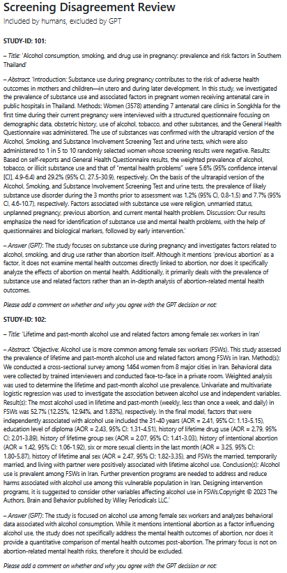

This article explains how to use the `report()` function to generate a structured document that highlights disagreements between human and AI screening decisions.

## Setup

First, we load the necessary packages.

```{r}
#| echo: true
#| eval: false

library(dplyr)
library(AIscreenR)
```

## Step 1: Prepare Disagreement Data

The `report()` function requires a data frame containing studies where the human decision and the AI decision do not match. For this example, we'll use a small dataset from the package. The data can be found here: `inst/extdata/dis_sub.rda`.

## Step 2: Generate the Report

With the `disagreements` data frame ready, we can now use the `report()` function to generate a document. The function will create a Quarto (`.qmd`) file and render it into the format you specify (e.g., HTML, PDF, or Word).

The report will list each study, its title and abstract, the AI's answer, and a space for a human reviewer to add comments, making it easy to resolve each conflict.

In this example, we will generate an HTML report.

```{r}
#| echo: true
#| eval: false

# This code will generate a report in your current working directory
# The report will open automatically if 'open = TRUE'
report(
  data = disagreements,
  studyid = studyid,
  title = title,
  abstract = abstract,
  gpt_answer = longest_answer,
  human_code = human_code,
  final_decision_gpt_num = final_decision_gpt_num,
  file = "disagreement_report.qmd",
  format = "html",
  document_title = "Screening Disagreement Review",
  open = TRUE
)
```

### Automatic Subtitle Generation

Note that we did not provide a `document_subtitle`. The `report()` function automatically detects the nature of the disagreements in the data and generates an appropriate subtitle. In our example, since the data contains both types of disagreements (human included/AI excluded and vice-versa), the subtitle will be "Disagreement between humans and GPT".

## Report Output

Running the code above will produce an HTML file named `disagreement_report.html`. This will look like this:


