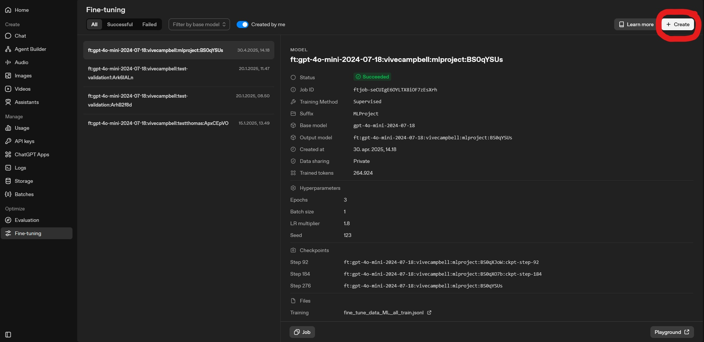
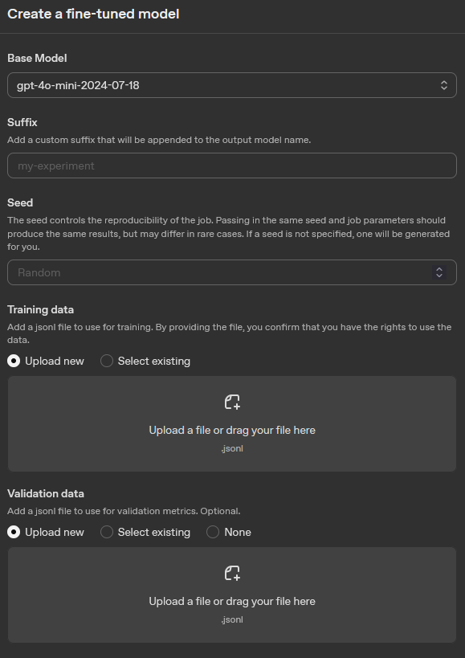
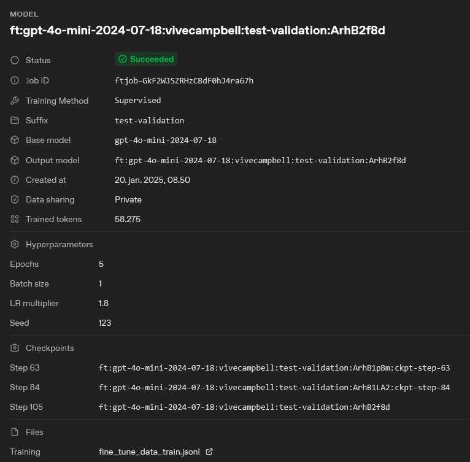

If you experience that the GPT model screening underperform, a solution is to fine-tune the model on your specific screening task. This article demonstrates how to prepare and format your data for fine-tuning OpenAI models using the `AIscreenR` package. The process involves two main functions: `create_fine_tune_data()` to structure the prompts and `save_fine_tune_data()` to save the data in the required `jsonl` format. See OpenAI’s fine-tuning guide for an overview of dataset preparation and format requirements [OpenAI Docs: Fine-tuning guide](https://developers.openai.com/api/docs/guides/supervised-fine-tuning).

## Setup

First, we load the necessary packages for this workflow. We will use `AIscreenR` for the main functions and `dplyr` for data manipulation.

```{r}
#| echo: true
#| eval: true

library(AIscreenR)
library(dplyr)
```

## Step 1: Prepare the initial data

For this example, we will use the `filges2015_dat` dataset included with the `AIscreenR` package. To create a balanced training set, we'll select 5 studies that were included and 5 that were excluded based on their `human_code`.

```{r}
#| echo: true
#| eval: true

# Extract 5 irrelevant (human_code == 0) and 5 relevant (human_code == 1) records.
sample_dat <- filges2015_dat[c(1:5, 261:265), ]

# Define the screening question or prompt for the model.
prompt <- "Is this study about functional family therapy?"
```

## Step 2: Generate fine-tuning data structure

The `create_fine_tune_data()` function takes your raw data and formats it into a structure suitable for fine-tuning. It combines the `title` and `abstract` with your `prompt` to create a complete question for each study.

```{r}
#| echo: true
#| eval: true

ft_data_generated <-
  create_fine_tune_data(
    data = sample_dat,
    prompt = prompt,
    studyid = studyid,
    title = title,
    abstract = abstract
  )

# Display the first record to see the structure
# We use strwrap to make the long 'question' text more readable.
strwrap(ft_data_generated$question[1])
```

The output is a tibble of class `ft_data` containing the `studyid`, `title`, `abstract`, and the newly created `question` column that will be used to train the model.

## Step 3: Add true answers and define the model's role

Before writing the data to a file, we need to add the true answers that the model will learn from. In this dataset, the `human_code` variable indicates the correct decision (1 for "Include", 0 for "Exclude"). We will create a `true_answer` column based on this.

We also need to define the `role_and_subject` for the model. This is a system message that tells the fine-tuned model how it should behave.

```{r}
#| echo: true
#| eval: true

ft_data_to_write <-
  ft_data_generated |>
  mutate(true_answer = if_else(human_code == 1, "Include", "Exclude"))

role_subject <- paste0(
  "Act as a systematic reviewer that is screening study titles and ",
  "abstracts for your systematic reviews regarding the the effects ",
  "of family-based interventions on drug abuse reduction for young ",
  "people in treatment for non-opioid drug use."
)
```

## Step 4: Write data to a .jsonl file

Finally, we use `save_fine_tune_data()` to convert our data frame into the `jsonl` format required by OpenAI. Each line in the output file will be a JSON object representing a single training example, containing the system message, the user prompt (our question), and the assistant's expected response (the true answer).

The function will write the file to your current working directory. OpenAI requires JSON Lines (.jsonl) files for fine-tuning datasets; see the fine-tuning data preparation guide and API reference for file requirements [OpenAI Docs: Fine-tuning guide](https://developers.openai.com/api/docs/guides/supervised-fine-tuning).

```{r}
#| echo: true
#| eval: false

# This code will write a file named "fine_tune_data.jsonl"
# to your working directory.
save_fine_tune_data(
  data = ft_data_to_write,
  role_and_subject = role_subject,
  file = "fine_tune_data.jsonl"
)
```

After running this code, you will have a `fine_tune_data.jsonl` file ready to be uploaded to the OpenAI platform to start a fine-tuning job.

## (Optional) Step 4: Splitting Data for Training and Validation

When fine-tuning a model, it's a best practice to provide two datasets: one for training and one for validation.

*   **Training Set**: The data the model learns from.
*   **Validation Set**: Data the model doesn't see during training. OpenAI allows you to supply an optional validation file; during training the service periodically evaluates metrics on this validation set and does not use it for gradient updates. This helps monitor generalization and overfitting [Medium: Fine-tuning guide](https://thetechplatform.medium.com/optimizing-your-dataset-a-guide-to-fine-tuning-with-openai-c6bff4054195).

A common approach is to use an 80/20 or 90/10 split, where the larger portion is used for training.

```{r}
#| echo: true
#| eval: false

# Set a seed for reproducibility of the random split
set.seed(123)

# Shuffle the data to ensure a random split
shuffled_data <- ft_data_to_write[sample(nrow(ft_data_to_write)), ]

# Define the split point for 80% training data
split_index <- floor(0.8 * nrow(shuffled_data))

# Create the training and validation sets
train_dat <- shuffled_data[1:split_index, ]
validation_dat <- shuffled_data[(split_index + 1):nrow(shuffled_data), ]

# You can check the number of rows in each set
cat(
  "Training set rows:", nrow(train_dat),
  "\nValidation set rows:", nrow(validation_dat)
)
```

## Step 5: Write data to .jsonl files

Finally, we use `save_fine_tune_data()` to convert our training and validation data frames into the `jsonl` format required by OpenAI. We will create two separate files.

```{r}
#| echo: true
#| eval: false

# This code will write two files to your working directory.

# Write the training data
save_fine_tune_data(
  data = train_dat,
  role_and_subject = role_subject,
  file = "training_data.jsonl"
)

# Write the validation data
save_fine_tune_data(
  data = validation_dat,
  role_and_subject = role_subject,
  file = "validation_data.jsonl"
)
```

After running this code, you will have `training_data.jsonl` and `validation_data.jsonl` files. When you create a fine-tuning job on the OpenAI platform, you can upload both of these files.

## Step 6: Uploading to OpenAI and Starting Fine-Tuning
To upload the files to OpenAI, navigate to the OpenAI platform and go to the fine-tuning section. This can be found using the following link: [OpenAI Platform: Fine-tuning](https://platform.openai.com/finetune). Here you can see previous fine-tuning jobs and create new ones. When creating a new fine-tuning job.

To create a new fine-tuning job, click the "Create" button. See picture below for reference.
{#fig:fine_tune}

After clicking "Create", you will firstly be prompted to select choose the fine-tuning method. For this we recommend selecting "Supervised", which is the most appropriate method for classification tasks. For more information see: [OpenAI Docs: Model optimization](https://developers.openai.com/api/docs/guides/model-optimization). After selecting the method, you will be asked to choose the model you want to fine-tune. This will be the base model that your fine-tuned version will be built upon. After selecting the model, you will be asked to upload your training and validation files. You can upload the `training_data.jsonl` and `validation_data.jsonl` files that you created in the previous steps. Here you can also specify the hyperparameters for your fine-tuning job, such as the number of epochs, batch size, and learning rate. Once you have configured all the settings, you can start the fine-tuning process. For more detailed information on fine-tuning jobs, see the OpenAI documentation: [OpenAI Docs: Fine-tuning guide](https://developers.openai.com/api/docs/guides/supervised-fine-tuning).

For reference see the picture below, which shows the interface for creating a fine-tuning job on the OpenAI platform.

{#fig:fine_tune_job}

## Step 7: Using the fine-tuned model for screening
After your fine-tuning job is complete, you will have a new model that is specifically trained on your screening task. You can use this fine-tuned model in the `tabscreen_gpt()` function by specifying the `model` argument with the name of your fine-tuned model and setting the `custom_model` argument to TRUE. This will allow you to leverage the improved performance of the fine-tuned model for your screening tasks.

First ensure that your fine-tuning job is completed successfully and that the performance metrics are satisfactory. Once the fine-tuning process is complete, you need to note the name of your fine-tuned model. The model name is specified in the "Output model" field of the fine-tuning job details page on the OpenAI platform. See picture below for reference. 
{#fig:model_done}

Once you have the model name, you can use it in the `tabscreen_gpt()` function as follows:
```{r}
#| echo: true
#| eval: false
# Example of using the fine-tuned model in tabscreen_gpt
result_obj <- 
  tabscreen_gpt(
    data = data, # The dataset containing the studies to be screened
    prompt = prompt, # The prompt to use for screening, should be the same as the one used for fine-tuning
    studyid = studyid, # The column in the dataset that contains the study IDs
    title = title, # The column in the dataset that contains the study titles
    abstract = abstract, # The column in the dataset that contains the study abstracts
    model = "ft:gpt-4o-mini-2024-07-18:vivecampbell:test-validation:ArhB2f8d", # The model to use for screening, now set to the name of your fine-tuned model
    reps = 1, # Number of repetitions (set to 1 for this example)
    decision_description = FALSE, # Whether to include the model's reasoning in the output (set to FALSE for this comparison)
    custom_model = TRUE # Set to TRUE to indicate that we are using a fine-tuned model
)
```

The `tabscreen_gpt()` function will now use your fine-tuned model for screening, which should yield improved performance on your specific task compared to using a base model.